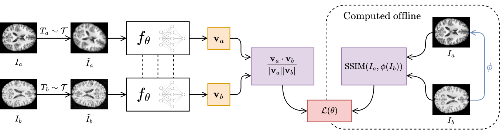

<h4 align="center">A Novel Metric for Detecting Memorization in Diffusion Models for Brain MRI Synthesis</h4>

This repository contains the official code for our paper on DeepSSIM, a novel automated metric for detecting training data memorization in diffusion models applied to medical imaging. While diffusion models show great promise in generating synthetic medical data, they are vulnerable to memorizing sensitive information. DeepSSIM addresses this risk by detecting memorized content, often missed by existing methods.<br/>
We evaluate DeepSSIM on a **Latent Diffusion Model (LDM)** trained on **2,195 2D MRI scans** from the publicly available **IXI** and **CoRR** datasets, under settings intentionally designed to induce memorization. Compared to state-of-the-art memorization metrics, DeepSSIM achieves superior performance, improving F1-scores by an average of **+52.86%** over the best existing method.

## Installation

We recommend using a dedicated virtual environment, such as [Anaconda](https://www.anaconda.com/), to avoid dependency conflicts. The code has been tested with Python 3.9, but it is expected to work with newer versions as well.<br/>
Clone the repository and install the package in editable mode:

```console
git clone https://github.com/AnonymAuthorr/DeepSSIM.git
cd DeepSSIM/
pip install -e .
```

## Training

<p align="center">
    
</p>

The DeepSSIM neural network can be trained using the command below. You can monitor training progress using TensorBoard: `tensorboard --logdir logs/EXP_NAME/tensorboard`. If you prefer to skip this step, you can download our pre-trained model [here](...) — we suggest placing it in the dedicated folder `/models/`.

```console
python3 train.py \
  --exp_name STR \
  --use_gpu

optional arguments:
  --dataset_images_dir   PATH    Path to the input image dataset directory
  --dataset_csv          PATH    Path to the dataset CSV file (training + validation)
  --emb_dim              INT     Size of the output embedding vector
  --num_workers          INT     Number of parallel worker processes
  --epochs               INT     Number of epochs
  --batch_size           INT     Batch size
  --learning_rate        FLOAT   Learning rate
  --weight_decay         FLOAT   Weight decay (regularization)
  --dropout_prob         FLOAT   Dropout probability
```

## Usage

Since each model produces an embedding for each image rather than a direct similarity score between image pairs, the corresponding similarity matrix must first be derived. This can be done by running the following command. If you prefer to skip this step, you can download our pre-computed similarity matrices [here](...) along with the corresponding index files [here](...), which are required to access matrix elements — we suggest placing them in `/data/matrices/` and `/data/indices/`, respectively.

```console
python3 compute_matrix.py \
  --model_path PATH \
  --metric_name {deepssim, chen, dar} \
  --use_gpu

optional arguments:
  --augment                     Use data augmentation on the test set
  --dataset_images_dir   PATH   Path to the input image dataset directory
  --embeddings_dir       PATH   Path to the directory to save image embeddings
  --indices_dir          PATH   Path to the directory to save image indices
  --matrices_dir         PATH   Path to the directory to save the score matrix
  --num_workers          INT    Number of parallel worker processes
  --batch_size           INT    Batch size
```

To evaluate a given metric, run the following command. This script computes the macro F1-score, as well as per-class precision and recall, based on the similarity matrix and index files previously computed.

```console
python3 eval.py \
  --matrix_path PATH \
  --metric_name {deepssim, chen, dar}

optional arguments:
  --testset_csv          PATH   Path to the test set CSV file
  --synth_indices_path   PATH   Path to the synthetic indices file (.npz)
  --real_indices_path    PATH   Path to the real indices file (.npz)
```

To evaluate the original SSIM, run the following command. This script computes the macro F1-score, as well as per-class precision and recall, by calculating scores for each image pair in the test set.

```console
python3 eval_ssim.py

optional arguments:
  --augment                     Use data augmentation on the test set
  --testset_csv          PATH   Path to the test set CSV file
  --dataset_images_dir   PATH   Path to the input image dataset directory
```

To generate the histogram visualizations reported in the paper, run the following command. This script requires a similarity matrix and the corresponding index files previously computed.

```console
python3 plot_reports.py \
  --matrix_path PATH \
  --output_path PATH \
  --exp_title STR \
  --low_threshold FLOAT \
  --upper_threshold FLOAT

optional arguments:
  --testset_csv          PATH   Path to the test set CSV file
  --synth_indices_path   PATH   Path to the synthetic indices file (.npz)
  --real_indices_path    PATH   Path to the real indices file (.npz)
```

## Citation

Please, reference this publication if you find this code useful:

```bib
@inproceedings { ...,
    author    = {...},
    title     = {...},
    booktitle = {...},
    year      = {...},
    url       = {...},
    doi       = {...}
}
```
